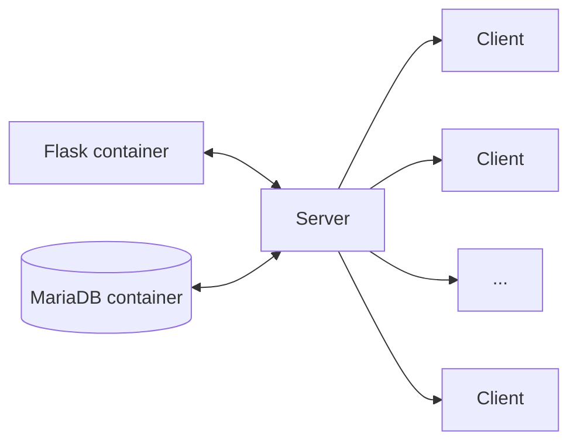

# Presentation

This solution provides a modern web interface to centralize and simplify reading log files from remote machines. The application is designed for easy installation (Dockerized) and includes a simple privilege system to control user access.

## Table of contents
- [Diagram](#diagram)
- [Features](#features)
- [Roles](#roles)
- [Database](#database)
- [Security](#security)

## Diagram

## Features

1. **Logging**
    - Read one or multiple files at once.
    - From one or many client machines.
    - Results sorted by timestamp (descending).
    - Errors displayed. *(SSH connection failure, permission problems on remote machine)*.
    - Manage the list of log file paths available from the web UI.
2. **Machines management**
    - Add a machine *(hostname, IP)*.
    - Edit a machine.
    - Remove a machine.
3. **Users management**
    - Add a user *(username, role and password)*.
    - Edit a user.
    - Remove a user.

## Roles

| Role | Privileges |
|:----:|:-----------|
| User | View logs |
| Manager | View logs Manage machines |
| Administrator | View logs Manage machines Manage users Manage the list of log files |

## Database

The database is **pre-populated** with **example data** to help testing and onboarding. Example accounts are provided for quick tests but should be removed before going to production.

| Login | Password |
|:-----:|:--------:|
| admin | admin |
| manager | manager |
| user | user |

*(You can remove these seed entries from the web interface.)*

## Security

1. User passwords are **hashed** (SHA-256).
2. An **encryption key** is used to secure **sessions**, **cookies** and **form submissions**.
3. A helper script is provided to ease per-file **permission management** on client machines.
