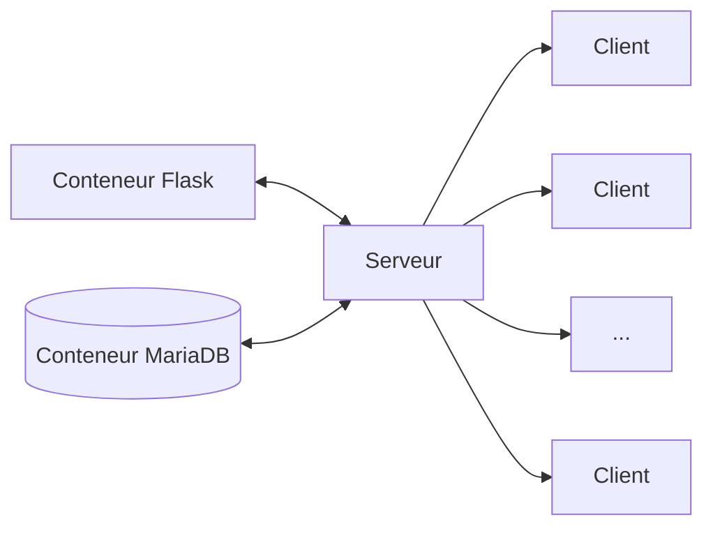

# Présentation

Cette solution fournit une interface web moderne qui permet de centraliser et de simplifier la lecture de fichiers de logs sur des machines distantes. L'installation de l'application est prévue pour être simple (Dockerisation). Il y a aussi un système de privilège qui donne accès à différentes ressources aux utilisateurs.

## Sommaire
- [Schéma](#schéma)
- [Fonctionnalités](#fonctionnalités)
- [Rôles](#rôles)
- [Base de données](#base-de-données)
- [Sécurité](#sécurité)

## Schéma

## Fonctionnalités

1. **Journalisation**
    - Lecture d'un ou plusieurs fichier à la fois.
    - Sur une à plusieurs machines.
    - Triés par ordre chronologique décroissant.
    - Avec affichage des erreurs. *(Connexion SSH impossible, problème de droits sur la machines distante)*.
    - Gestion de la liste de fichiers que l'on peut demander depuis l'application.
2. **Gestion des machines**
    - Ajouter une machine *(Nom d'hôte, ip)*.
    - Modifier une machine.
    - Supprimer une machine.
3. **Gestion des utilisateurs**
    - Ajouter un utilisateur *(Nom, rôle et mot de passe)*.
    - Modifier un utilisateur.
    - Supprimer un utilisateur.

## Rôles

| Rôle | Privilège(s) |
|:----:|:-------------|
|Utilisateur|Consultation de journaux|
|Gestionnaire|Consultation de journaux Gestion des machines|
|Administrateur|Consultation de journaux Gestion des machines Gestion des utilisateurs Gestion de la liste de journaux|

## Base de données

La base de données est **pré-remplie** avec des **jeux de données d'exemple** (insertions). Dont des utilisateurs qui peuvent servir à effectuer des tests mais qu'il faudra supprimer par la suite notamment pour passer en production.

| Login | Mot de passe |
|:-----:|:------------:|
|admin|admin|
|manager|manager|
|user|user|

*(Il est facile depuis l'interface graphique de retirer les insertions inutiles.)*

## Sécurité

1. Mot de passes utilisateurs **hashés** *(SHA 256)*.
2. **Clé d'encryption** pour sécuriser les **sessions**, **cookies** et les **envois de formulaires**.
3. Proposition d'un script qui permet de faciliter le **contrôle des droits** fichier par fichier sur les machines distantes.